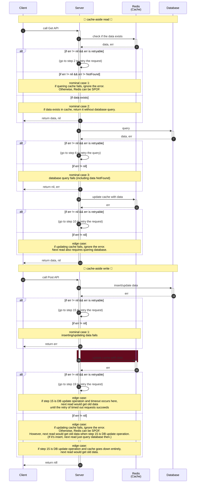
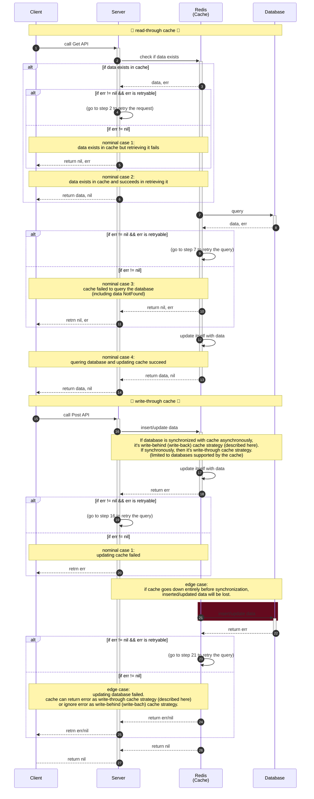

# Sequence
## Naive cache-aside read/write strategy (servers query/update cache manually)
- Actual read/write operations can occur in any order although following sequences are written from Read and then Write.
- **With cache-aside strategy, ensuring that the step colored with Red in cache-aside write processes succeeds contributes to the synchronization between cache and database**


## Naive read/write-through cache strategy (cache query/update database synchronously) / Write-Behind/Back cache strategy (asynchronously)
- Actual read/write operations can occur in any order although following sequences are written from Read and then Write.


# Problems
1. cache miss in both strategies
    - A cache miss occurs when non-existent data is queried, resulting in unnecessary load on the database
1. cache staleness in cache-aside strategy
    - when updating database succeeds and updating cache fails, next read retrieves old data from cache
1. data loss in cache-through strategy
    - if a cache node which accepts write requests goes down before synchronizing database, data loss happens

# Solutions
## cache miss in both strategies
### How to avoid cache miss
- Regardless of which cache strategies we use, if there is no entry in cache, we must query database, possibly leading to latency degradation, database overload, or even cache miss attack
- So, identifying whether requested data is existent before querying database (and cache) mitigates this issue
- Redis provides [Bloom Filter](https://en.wikipedia.org/wiki/Bloom_filter) as BF prefixed commands such as [BF.RESERVE](https://redis.io/docs/latest/commands/bf.reserve/), [BF.ADD](https://redis.io/docs/latest/commands/bf.add/) and [BF.EXISTS](https://redis.io/docs/latest/commands/bf.exists/)
- However, **if we use these commands, we cannot avoid loading Redis at least since we need to communicate with Redis to execute the filtering**
- On the other hand, 
    - if we manage 1 server and it executes all filterings, that server can be SPOF
    - if we manage multiple servers and each executes their own filterings, false negative (reliability breach) can occur where one server updates its filter when handling write request and others execute filtering when handling read request but no set bits achknowledged
- Therefore, **distributed filtering works here where each server manages a common filter synchronized to others.**


### New filtering algorithm ("R Filter")
- By the way, I wondered how efficient Bloom Filter is as filtering mechanism while thinking about cache miss issue.
- I'd like to experiment the efficiency with my own algorithm (let's say "R Filter" here)
- R Filter consists of Trie with unique ID generation algorithm (like xxhash) and base 62 conversion with fixed length (like 6)
    - unique ID generation algorithm should have the folowing properties:
        - numeric value
        - deterministic
        - uniquely distributed
- R Filter works as follows:
    1. when servers start, initialize Trie internally
    1. when servers handle write requests, 
        1. they generate an unique numeric value based on the given string key with hash algorithm
        1. they divide the numeric value by 62 and convert each modulus value to [0-9a-zA-Z] and repeat this process until its length reaches the predefined threshold
        1. they update their own Trie with the base 62 converted key
    1. when servers handle read requests,
        1. they follow the above same procedures to generate base 62 converted keys
        1. if the key exists in the Trie, the entry can exist in data store (possibly false positive)
        1. Otherwise, the key doesn't exist in data store (definitely true negative)
- memory space with length 6 can be 62 to the power of 6 (62^6 == 56,800,235,584, up to 56 GB)

#### Procedures
```bash
$ docker run --pull=always --name scylladb -p "9042:9042" -d scylladb/scylla && sleep 8 && docker exec -it scylladb cqlsh -e "CREATE KEYSPACE example WITH replication = {'class': 'NetworkTopologyStrategy', 'replication_factor' : 1};"
$ go run application_cache/r_filter/main.go -algorithm=r_filter -requests=1000000 -hash=xxhash -length=7
$ go run application_cache/r_filter/main.go -algorithm=bloom_filter -requests=1000000 -hash=xxhash -bits=10000000 -position=7
$ docker stop $(docker ps -q -f name=scylladb) && docker rm $(docker ps -aq -f name=scylladb)
```

For cluster:  
Due to the Little's Law (L=λW), if we want 1 million RPS with 1 ms latency, concurrency should be 1k.

```bash
$ docker compose -f docker-compose.scylladb.yml up -d --pull=always
$ while true; do clear; docker exec scylladb-1 nodetool status; sleep 1; done
$ docker exec -it scylladb-1 cqlsh -e "CREATE KEYSPACE IF NOT EXISTS example WITH replication = {'class': 'NetworkTopologyStrategy', 'replication_factor' : 1};"
# following commands might take one minute
$ go run application_cache/r_filter/main.go -cluster -algorithm=r_filter -requests=1000000 -hash=xxhash -length=7
$ go run application_cache/r_filter/main.go -cluster -algorithm=bloom_filter -requests=1000000 -hash=xxhash -bits=10000000 -position=7
$ docker compose -f docker-compose.scylladb.yml down -v
```


Following table shows sample results for each combination (algorithm x length). Length 6~ looks better.
| algorithm | requests | semaphore | hash function | (R) length | (Bloom) bits | (Bloom) position | execution time (ms) | memory usage (MB) | TRUE Positive | TRUE negative | false Positive | false negative | other (error) | RPS |
|--|--|--|--|--|--|--|--|--|--|--|--|--|--|--|
| R Filter | 10_000_000 | 1000 | xxhash | 7 | - | - | 282072 | 55102 | 55102 (1.10%) | 4944895 (98.90%) | 3 (6.00%) | 0 (0%) | 0 (0%) | 17725 |
| Bloom Filter | 10_000_000 | 1000 | xxhash | - | 100_000_000 | 10 | 310449 | 95 | 52766 (1.06%) | 4947196 (98.94%) | 38 (0.0008%) | 0 (0%) | 0 (0%) | 16105 |


## cache staleness in cache-aside strategy
### Invalidating cache when executing Write (for single instance)
- This means invalidating cache entry at the beginning of cache-aside write process.
- Next read must query database due to the invalidated entry, leading to no cache staleness.
- However, on the other hand, **we must ensure the availability of cache in order to prevent failures in cache invalidation and also not to make cache SPOF.**
    - In other words, **cache invalidation transforms a consistency problem into an availability problem.**

#### Procedures
```bash
$ redis-server --save ""
$ docker run --name scylladb -p "9042:9042" -d scylladb/scylla --smp 1 && sleep 5 && docker exec -it scylladb cqlsh -e "CREATE KEYSPACE example WITH replication = {'class': 'NetworkTopologyStrategy', 'replication_factor' : 1};" > /dev/null
$ go run application_cache/cache_invalidation/main.go
$ docker stop $(docker ps -q -f name=scylladb) && docker rm $(docker ps -aq -f name=scylladb)
$ redis-cli shutdown
```

sample result is:
```bash
database insert succeeded with: 17:42:02.28179
cache update succeeded with: 17:42:02.28179
****** 1st cache-aside write ends ******

database update succeeded with: 17:42:02.28445
cache-aside write failed intentionally: error caused before updating cache with: 17:42:02.28445
****** 2nd cache-aside write ends ******

retrieving data from cache succeeded: 17:42:02.28179
******    cache-aside read ends   ******

write result and next read result are inconsistent [NG]

************ ************ ************ ************ ************ ************ ************ ************

cache invalidation succeeded
database insert succeeded with: 17:42:02.28707
cache update succeeded with: 17:42:02.28707
****** 1st cache-aside write ends ******

cache invalidation succeeded
database update succeeded with: 17:42:02.28811
cache-aside write failed intentionally: error caused before updating cache with: 17:42:02.28811
****** 2nd cache-aside write ends ******

database query succeeded: 17:42:02.28811
******    cache-aside read ends   ******

write result and next read result are synchronized [OK]
```

### Invalidating cache when executing Write (for cluster)
- As I mentioned in [the rate limiter section](../rate_limiter/README.md#redis-cluster), Redis cluster uses asynchronous replication, leading to eventual consistency
- This property contributes to cache staleness more
- However, Redis provides [WAIT](https://redis.io/docs/latest/commands/wait/) and [WAITOF](https://redis.io/docs/latest/commands/waitaof/) commands to wait for acknowledgements given by possibly specified number of replicas within the given timestamp
- With these commands, we can increase real-world data consistency.
    - If we specify timeout as 0, it blocks forever, resulting in strong consistency theoretically.
    - But, as [Redis reports officially here](https://redis.io/docs/latest/commands/wait#consistency-and-wait), consistency level shouldn't still reach strong due to the possible data loss during failover.

#### Procedures
```bash
$ INSTANCES=20
$ for port in $(seq 7000 $((7000 + $INSTANCES - 1))); do redis-server --port $port --cluster-enabled yes --cluster-config-file nodes-$port.conf --replica-serve-stale-data no --appendonly yes & sleep 0.2; done
# jobs
$ redis-cli --cluster create $(for port in $(seq 7000 $((7000 + $INSTANCES - 1))); do echo -n "127.0.0.1:$port "; done) --cluster-replicas 1 --cluster-yes
$ docker run --name scylladb -p "9042:9042" -d scylladb/scylla --smp 1 && sleep 5 && docker exec -it scylladb cqlsh -e "CREATE KEYSPACE example WITH replication = {'class': 'NetworkTopologyStrategy', 'replication_factor' : 1};" > /dev/null
$ go run application_cache/cache_invalidation/main.go -cluster -instances=$INSTANCES -numreplicas=1 -timeout=4000
$ docker stop $(docker ps -q -f name=scylladb) && docker rm $(docker ps -aq -f name=scylladb)
$ for port in $(seq 7000 $((7000 + $INSTANCES - 1))); do redis-cli -p $port shutdown; done && rm -rf nodes*.conf dump.rdb appendonlydir
```


## data loss in cache-through strategy
- while cache-through strategy doesn't have consistency issue, data loss could happen due to node failures before database synchronization
- As I mentioned in the [Invalidating cache when executing Write (for cluster)](#invalidating-cache-when-executing-write-for-cluster), as we can increase practical data consistency by tuning WAIT command parameters along with asynchronous replication used by Redis cluster, we can't have strong consistency strictly due to possible data loss in failovers
- In other words, as long as we use Redis, we should adopt cache-through strategy since we can ensure availability more easily than consistency where strict strong consistency cannot be achieved
- However, since Redis supports cache-through logic only for limited databases, cache-through strategy isn't one size fits all solution (we might need to choose cache-aside strategy with tuning)


Let me walk through [some of v7.2 redis.conf parameters](https://raw.githubusercontent.com/redis/redis/7.2/redis.conf) which might increase availability of Redis cluster


### appendonly
We should flip this value to support AOF since [RDB performs snapshots of current data](https://redis.io/docs/latest/operate/oss_and_stack/management/persistence/#rdb-disadvantages) and unavailable for replaying commands.
```bash
# By default Redis asynchronously dumps the dataset on disk. This mode is
# good enough in many applications, but an issue with the Redis process or
# a power outage may result into a few minutes of writes lost (depending on
# the configured save points).
#
# The Append Only File is an alternative persistence mode that provides
# much better durability. For instance using the default data fsync policy
# (see later in the config file) Redis can lose just one second of writes in a
# dramatic event like a server power outage, or a single write if something
# wrong with the Redis process itself happens, but the operating system is
# still running correctly.
#
# AOF and RDB persistence can be enabled at the same time without problems.
# If the AOF is enabled on startup Redis will load the AOF, that is the file
# with the better durability guarantees.
#
# Please check https://redis.io/topics/persistence for more information.

appendonly no
```

### appendfsync
We might consider `always` option while measuring performance impacts. But, as Redis officially says, its performance can be much worse than default `everysec`.
```bash
# The fsync() call tells the Operating System to actually write data on disk
# instead of waiting for more data in the output buffer. Some OS will really flush
# data on disk, some other OS will just try to do it ASAP.
#
# Redis supports three different modes:
#
# no: don't fsync, just let the OS flush the data when it wants. Faster.
# always: fsync after every write to the append only log. Slow, Safest.
# everysec: fsync only one time every second. Compromise.
#
# The default is "everysec", as that's usually the right compromise between
# speed and data safety. It's up to you to understand if you can relax this to
# "no" that will let the operating system flush the output buffer when
# it wants, for better performances (but if you can live with the idea of
# some data loss consider the default persistence mode that's snapshotting),
# or on the contrary, use "always" that's very slow but a bit safer than
# everysec.
#
# More details please check the following article:
# http://antirez.com/post/redis-persistence-demystified.html
#
# If unsure, use "everysec".

# appendfsync always
appendfsync everysec
# appendfsync no
```


### cluster-node-timeout
We can consider tuning this value depending on each environment.
```bash
# Cluster node timeout is the amount of milliseconds a node must be unreachable
# for it to be considered in failure state.
# Most other internal time limits are a multiple of the node timeout.
#
# cluster-node-timeout 15000
```


