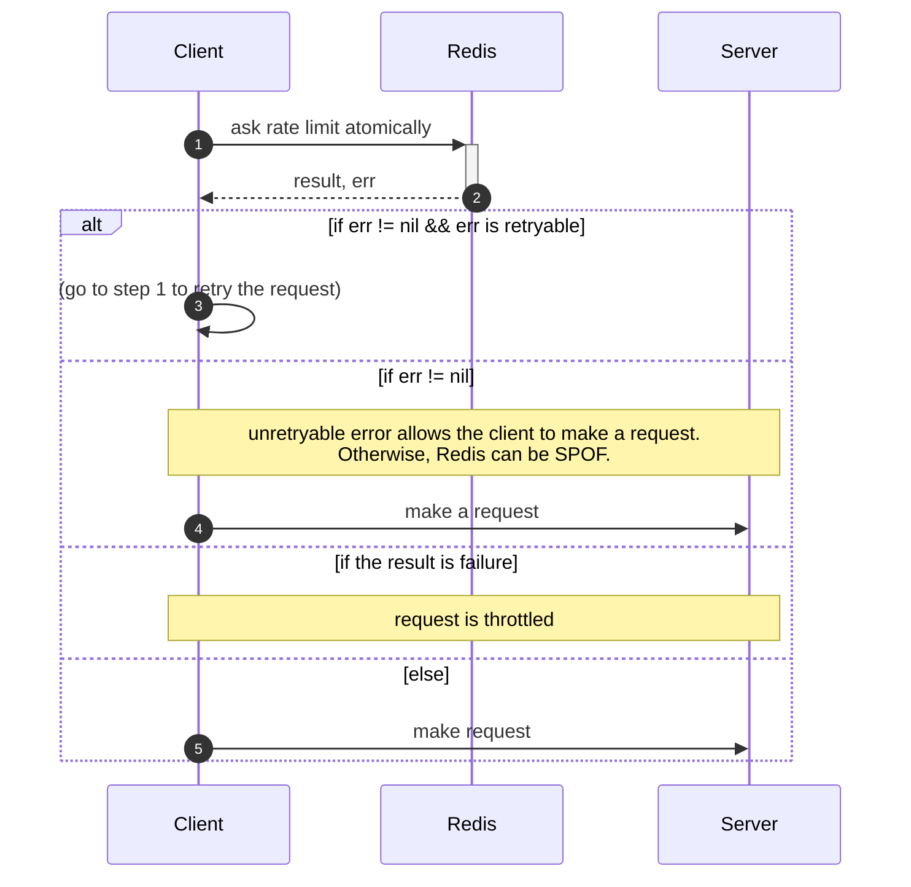

# Why Redis for Rate Limiter?
- high performance due to in-memory store
- atomicity support with lua script
- variety of data structures (Sorted Sets, Streams etc...)

# Sequence
- For convenience, I omit the following perspectives:
    - retry with (expornential) backoff with jitter
    - returning 429 status code to the caller of the client when current count is greater than the threshold



# Lua scripts
## Token bucket
```lua
local key = KEYS[1]
local t = redis.call('TIME')
local now_ms = tonumber(t[1]) * 1000 + tonumber(t[2]) / 1000
local t_key = key .. '-t'
local refill_rate = tonumber(ARGV[1])
local bucket_size = tonumber(ARGV[2])

local tokens = tonumber(redis.call('GET', key) or 0)
local last = tonumber(redis.call('GET', t_key) or 0)
local duration = math.max(0, now_ms - last)
tokens = math.min(bucket_size, tokens + math.floor(duration / 1000 * refill_rate))

if tokens == 0 then
    return 0
end

redis.call('SET', key, tokens - 1)
redis.call('SET', t_key, now_ms)
return 1
```

## Sliding window log
```lua
local key = KEYS[1]
local t = redis.call("TIME")
local now_ms = tonumber(t[1]) * 1000 + tonumber(t[2]) / 1000
local ttl_ms = tonumber(ARGV[1])
local threshold = tonumber(ARGV[2])

redis.call("ZREMRANGEBYSCORE", key, "-inf", now_ms - ttl_ms - 1)
local count = redis.call("ZCARD", key)

if count == threshold then
    return 0
end

redis.call("ZADD", key, now_ms, now_ms)
return 1
```


# Logic verification
## Token bucket
```bash
DEL user_id_1

ZRANGE user_id_1 0 -1 withscores

EVAL "local key = KEYS[1] local t = redis.call('TIME') local now_ms = tonumber(t[1]) * 1000 + tonumber(t[2]) / 1000 local t_key = key .. '-t' local refill_rate = tonumber(ARGV[1]) local bucket_size = tonumber(ARGV[2]) local tokens = tonumber(redis.call('GET', key) or 0) local last = tonumber(redis.call('GET', t_key) or 0) local duration = math.max(0, now_ms - last) tokens = math.min(bucket_size, tokens + math.floor(duration / 1000 * refill_rate)) if tokens == 0 then return 0 end redis.call('SET', key, tokens - 1) redis.call('SET', t_key, now_ms) return 1" 1 user_id_1 1 2
```

## Sliding window log
```bash
DEL user_id_1

ZRANGE user_id_1 0 -1 withscores

EVAL "local key = KEYS[1] local t = redis.call('TIME') local now_ms = tonumber(t[1]) * 1000 + tonumber(t[2]) / 1000 local ttl_ms = tonumber(ARGV[1]) local threshold = tonumber(ARGV[2]) redis.call('ZREMRANGEBYSCORE', key, '-inf', now_ms - ttl_ms - 1) local count = redis.call('ZCARD', key) if count == threshold then return 0 end redis.call('ZADD', key, now_ms, now_ms) return 1" 1 user_id_1 4000 2
```


# Performance
## Sample results from each run
| algorithm | numOfRequest | semaphoreSize | arg1 | arg2 | execution time | handled request | throttled request | Redis RPS | redis-server memory usage |
|:----:|:------------:|:---:|:---------:|:-------------:|:-------------:|:-------------------:|:---:|:---:|:---:|
| Token Bucket | 10_000_000 | 10_000_000 | 1000 (ttlms) | 1000 (threshold) | 93198 ms | 82012 | 258474 | 3653 | ~40 MB |
| Sliding Window Log | 10_000_000 | 10_000_000 | 1000 (refillRate) | 1000 (bucketSize) | 91960 ms | 88328 | 238241 | 3551 | ~40 MB |

## Procedures
```bash
$ redis-server --save "" --io-threads 7 --hz 100
$ go run rate_limiter/main.go -algorithm="token_bucket" -numOfRequest=10000000 -semaphoreSize=10000000
$ redis-cli shutdown
```


# Redis cluster
## Limitation
- Redis Cluster does not support strong consistency, which **may result in less strict rate limiting**

## Characteristics
- Very high performance and scalability while preserving weak but reasonable forms of data safety and availability is the main goal of Redis Cluster.
    - > *Normal operations are handled exactly as in the case of a single Redis instance. This means that in a Redis Cluster with N master nodes you can expect the same performance as a single Redis instance multiplied by N as the design scales linearly. At the same time the query is usually performed in a single round trip, since clients usually retain persistent connections with the nodes, so latency figures are also the same as the single standalone Redis node case.*
- **Doesn't support strong consistency** due to asynchronous replication
    - **even when synchronous replication is used**
- Not using consistent hashing but hash slot (CRC16 of the key modulo 16384)
    - hash tags (following are the same hash slot)
        - `user:{123}:profile`
        - `user:{123}:account`
    - > *Moving hash slots from a node to another does not require stopping any operations; therefore, adding and removing nodes, or changing the percentage of hash slots held by a node, requires no downtime.*
    - > *currently there is no way for redis-cli to automatically rebalance the cluster checking the distribution of keys across the cluster nodes and intelligently moving slots as needed. This feature will be added in the future.*
- Master-replica architecture for every hash slot

For more details, please refer to the [official documentation](https://redis.io/docs/latest/operate/oss_and_stack/management/scaling/).

## Sample results from each run
| cluster | algorithm | numOfRequest | semaphoreSize | arg1 | arg2 | execution time | handled request | throttled request | Redis RPS | redis-server memory usage |
|:----:|:----:|:------------:|:---:|:---------:|:-------------:|:-------------:|:-------------------:|:---:|:---:|:---:|
| true | Token Bucket | 10_000_000 | 10_000_000 | 1000 (ttlms) | 1000 (threshold) | 90539 ms | 80408 | 264187 | 3806 | ~30 MB * N |
| true | Sliding Window Log | 10_000_000 | 10_000_000 | 1000 (refillRate) | 1000 (bucketSize) | 91934 ms | 87686 | 246166 | 3631 | ~30 MB * N |

## Procedures
```bash
$ END_PORT=7019
$ for port in $(seq 7000 "$END_PORT"); do redis-server --port $port --cluster-enabled yes --cluster-config-file nodes-$port.conf --replica-serve-stale-data no --appendonly yes & sleep 0.2; done
# jobs
$ redis-cli --cluster create $(for port in $(seq 7000 "$END_PORT"); do echo -n "127.0.0.1:$port "; done) --cluster-replicas 1 --cluster-yes
$ go run rate_limiter/main.go -cluster -algorithm="token_bucket" -numOfRequest=10000000 -semaphoreSize=10000000
$ for port in $(seq 7000 "$END_PORT"); do redis-cli -p $port shutdown; done && rm -rf nodes*.conf dump.rdb appendonlydir
```
